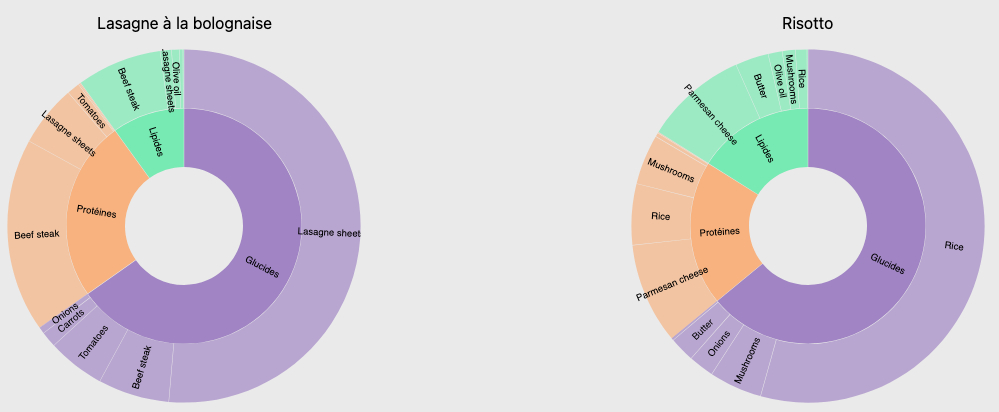
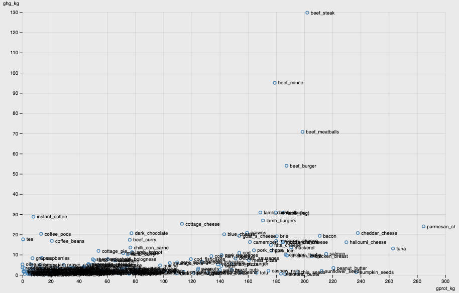

# Challenge Open Data

## Membres du groupe

- Maud Bergonzoli
- Anaïs Potel
- Guilherme Faccin Huth
- Bruno Carrère
- Samuel Thiken

## Introduction

L'objectif de ce projet est de mettre en oeuvre une visualisation d'un grand nombre de données open data. En effet, on se retrouve aujourd'hui à avoir de plus en plus de données. Mais sans pouvoir interpréter ces données, il serait inutile de les récolter.

Ainsi, à partir d'un jeu de données préalablement choisi, nous allons mettre en valeur certains aspects des données afin de pouvoir en extraire le plus d'information possible. Pour cela, il sera nécessaire de choisir une représentation graphique adaptée des données afin d'avoir une visualisation lisible et compréhensible pour un humain.
## Jeu de données choisi

Nous avons donc choisi le jeu de données fourni par : Environmental impacts of food (Clark et al. 2022)

Ce set de données indique, pour une liste étendue d'ingrédients, leurs impacts environnementaux (eau requise, espace nécessaire, quantité de gaz à effet de serre émise) ramené au poids, nombre de calories ou de protéines.

Le but est alors d'évaluer, selon ces critères, l'impact de plats typiquement français. On peut notamment prendre comme exemple les plats suivants, composés d'ingrédients simples :

- Poulet basquaise : poulet, tomates, poivrons, oignons, huile d'olive
- Gratin dauphinois : patates, crème, lait
- Boeuf bourguignon : boeuf, vin, carottes, oignons.

De plus, pour chaque plat, on cherche à mettre en valeur la quantité de glucides, lipides et protéines pour chaque ingrédient.

On notera que ces données proviennent du Royaume-Uni. On peut donc supposer que cela faussera nos résultats puisque la majorité des produits peuvent provenir de France. Cependant, on peut ajouter deux suppositions plausibles pour contrer ces inquiétudes.

La première réside dans le fait que le climat et les pratiques du Royaume-Uni et de la France sont suffisamment proches pour estimer un coût similaire pour les différentes denrées.

La seconde découle de l'étude proposée par Hannah Ritchie sur l'impact du transport vis-à-vis de la production de la nourriture. Cet article indique donc que l'on peut considérer l'impact du transport depuis le Royaume-Uni vers la France comme nul en comparaison de l'impact de la production elle-même.
## Interface et interactions

Nous avons créé un dashboard qui permet de sélectionner les plats que l'on souhaite comparer.

Sur un premier graphique, on peut sélectionner les informations que l'on veut comparer entre les différents plats sélectionnés. Les informations à comparer portent sur les impacts environnementaux d'un plat. On obtient alors un diagramme à barres groupées et empilées nous permettant de comparer les plats sur les critères sélectionnés.

Dans une seconde partie, pour chaque plat sélectionné, on affiche un graphique en anneaux indiquant la quantité de glucides, de lipides et de protéines que chaque ingrédient apporte au plat.
## Architecture et bibliothèques

Pour afficher les données sous forme de page web, nous avons choisi de rester sur un fonctionnement assez simple, en n'utilisant aucun framework Javascript autre que D3.js pour l'affichage des différents graphiques.

Cette approche nous permet de nous concentrer sur les graphiques et les données affichées, sans avoir trop de fichiers à gérer, ce qui pourrait être le cas si nous utilisons un framework comme React ou Vue. En n'incluant pas ces framework, nous pouvons être plus sereins quant à la taille finale du rendu, ce dernier étant limité à 10 Mo.

Afin d'éviter la redondance de code et d'avoir un code propre et factorisé, nous avons utilisés les web components. Cela a également facilité la répartition des tâches.

Les données seront directement récupérées à leur source, aucune copie ne sera faite sur le serveur d'hébergement de notre page web.
## Traitements opérés

Après avoir été parsées, les données sont envoyés dans des instances de la classe Ingredient. Elles servent au calcul de valeurs pour chaque plat, représentant l'apport calorique (protéines, glucides, lipides), les émissions de GES, l'utilisation des sols, et l'utilisation d'eau.

Ces valeurs sont alors représentées par un diagramme à barres, ainsi qu'un graphique en anneaux. Les unités pour chaque valeur sont les suivantes (éventuellement rapportées par kg de l'aliment cible):

- Emission gaz à effet de serre : kg
- Utilisation du sol : m²
- Utilisation de l'eau : L
- Apport caloriques : kcal

D'autre part, notre base de données nous ayant fourni des valeurs en grammes d'émissions de gaz à effet de serre par gramme de protéines et de matières grasses, nous avons pensé qu'il serait plus approprié pour notre application de les convertir et de les stocker en grammes de protéines et de matières grasses par kg d'aliments, respectivement.

Comme on peut le voir sur la page Wikipedia, nous disposons de 3 macronutriments essentiels : les protéines, les glucides et les lipides. On peut convertir leur masse en grammes en énergie mesurée en kcal. Nous avons notamment utilisé cela pour calculer les apports en glucides pour chaque aliment, les autres valeurs étant calculables via les différentes valeurs pour les émissions de gaz à effet de serre.

Il y avait également des valeurs manquantes, elles ont donc été analysées individuellement et une valeur de zéro leur a été attribuée au momment de traiter les données
## Analyse Green IT
Challenge Open Data
Membres du groupe

    Maud Bergonzoli
    Anaïs Potel
    Guilherme Faccin Huth
    Bruno Carrère
    Samuel Thiken

Introduction

L'objectif de ce projet est de mettre en oeuvre une visualisation d'un grand nombre de données open data. En effet, on se retrouve aujourd'hui à avoir de plus en plus de données. Mais sans pouvoir interpréter ces données, il serait inutile de les récolter.

Ainsi, à partir d'un jeu de données préalablement choisi, nous allons mettre en valeur certains aspects des données afin de pouvoir en extraire le plus d'information possible. Pour cela, il sera nécessaire de choisir une représentation graphique adaptée des données afin d'avoir une visualisation lisible et compréhensible pour un humain.
Jeu de données choisi

Nous avons donc choisi le jeu de données fourni par : Environmental impacts of food (Clark et al. 2022)

Ce set de données indique, pour une liste étendue d'ingrédients, leurs impacts environnementaux (eau requise, espace nécessaire, quantité de gaz à effet de serre émise) ramené au poids, nombre de calories ou de protéines.

Le but est alors d'évaluer, selon ces critères, l'impact de plats typiquement français. On peut notamment prendre comme exemple les plats suivants, composés d'ingrédients simples :

    Poulet basquaise : poulet, tomates, poivrons, oignons, huile d'olive
    Gratin dauphinois : patates, crème, lait
    Boeuf bourguignon : boeuf, vin, carottes, oignons.

De plus, pour chaque plat, on cherche à mettre en valeur la quantité de glucides, lipides et protéines pour chaque ingrédient.

On notera que ces données proviennent du Royaume-Uni. On peut donc supposer que cela faussera nos résultats puisque la majorité des produits peuvent provenir de France. Cependant, on peut ajouter deux suppositions plausibles pour contrer ces inquiétudes.

La première réside dans le fait que le climat et les pratiques du Royaume-Uni et de la France sont suffisamment proches pour estimer un coût similaire pour les différentes denrées.

La seconde découle de l'étude proposée par Hannah Ritchie sur l'impact du transport vis-à-vis de la production de la nourriture. Cet article indique donc que l'on peut considérer l'impact du transport depuis le Royaume-Uni vers la France comme nul en comparaison de l'impact de la production elle-même.
Interface et interactions

Nous avons créé un dashboard qui permet de sélectionner les plats que l'on souhaite comparer.

Sur un premier graphique, on peut sélectionner les informations que l'on veut comparer entre les différents plats sélectionnés. Les informations à comparer portent sur les impacts environnementaux d'un plat. On obtient alors un diagramme à barres groupées et empilées nous permettant de comparer les plats sur les critères sélectionnés.

Dans une seconde partie, pour chaque plat sélectionné, on affiche un graphique en anneaux indiquant la quantité de glucides, de lipides et de protéines que chaque ingrédient apporte au plat.

Voici un aperçu de ce qui était initialement prévu:
Prévisualisation
Architecture et bibliothèques

Pour afficher les données sous forme de page web, nous avons choisi de rester sur un fonctionnement assez simple, en n'utilisant aucun framework Javascript autre que D3.js pour l'affichage des différents graphiques.

Cette approche nous permet de nous concentrer sur les graphiques et les données affichées, sans avoir trop de fichiers à gérer, ce qui pourrait être le cas si nous utilisons un framework comme React ou Vue. En n'incluant pas ces framework, nous pouvons être plus sereins quant à la taille finale du rendu, ce dernier étant limité à 10 Mo.

Afin d'éviter la redondance de code et d'avoir un code propre et factorisé, nous avons utilisés les web components. Cela a également facilité la répartition des tâches.

Les données seront directement récupérées à leur source, aucune copie ne sera faite sur le serveur d'hébergement de notre page web.
Traitements opérés

Après avoir été parsées, les données sont envoyés dans des instances de la classe Ingredient. Elles servent au calcul de valeurs pour chaque plat, représentant l'apport calorique (protéines, glucides, lipides), les émissions de GES, l'utilisation des sols, et l'utilisation d'eau.

Ces valeurs sont alors représentées par un diagramme à barres, ainsi qu'un graphique en anneaux.
## Analyse Green IT
